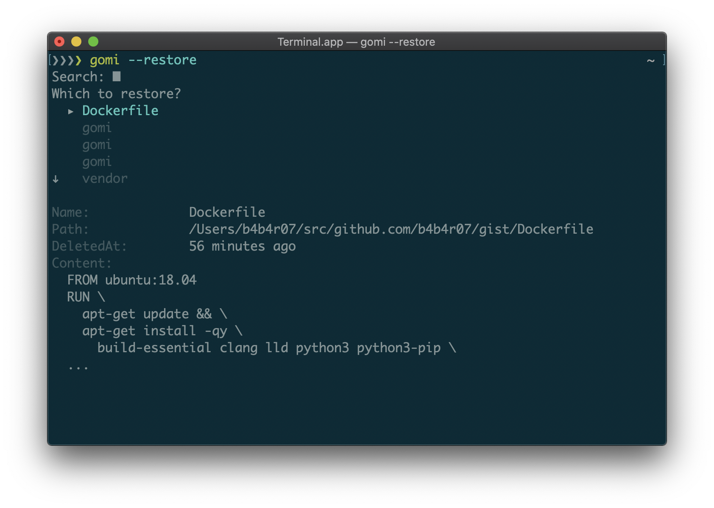

  

[][release] [][license] 

`gomi` is a simple trash tool that works on CLI, written in Go

The concept of the trashcan does not exist in Command-line interface ([CLI](http://en.wikipedia.org/wiki/Command-line_interface)). If you have deleted an important file by mistake with the `rm` command, it would be difficult to restore. Then, it's this `gomi`. Unlike `rm` command, it is possible to easily restore deleted files because `gomi` have the trashcan for the CLI.

## Features

- Like a `rm` command but not unlink (delete) in fact (just move to another place)
- Easy to restore, super intuitive
- Compatible with `rm` command, e.g. `-r`, `-f` options
- Nice UI, awesome CLI UX
- Easy to see what gomi does with setting `GOMI_LOG=[trace|debug|info|warn|error]`

## Installation

Download the binary from [GitHub Releases][release] and drop it in your `$PATH`.

- [Darwin / Mac][release]
- [Linux][release]

## Versus

- [andreafrancia/trash-cli](https://github.com/andreafrancia/trash-cli)
- [sindresorhus/trash](https://github.com/sindresorhus/trash)

## License

[MIT][license]

[release]: https://github.com/b4b4r07/gomi/releases/latest
[license]: https://b4b4r07.mit-license.org
