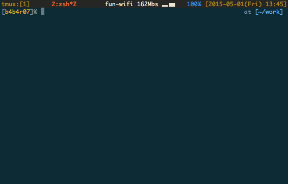

# gomi

`gomi` is a simple trash script that works on CLI, written in golang

## Description

`rm` command threaten the CLI beginner. This is because it would delete the file without going through the trash. I was re-invented the `rm` as delete command with the concept of trash. It's `gomi`. Even if you delete the file by mistake, it can easily be restored.

***DEMO:***



To make it easier to restore, it was adopted an interactive interface, such as a [peco]() and [percol]().

## Requirement

- Go

## Usage

1. **Remove!** Throw away the trash files :package:

		$ gomi files

2. **Restore!** Scavenge the trash box :mag:

		$ gomi -r

To delete really:

	$ gomi ~/.gomi/2015/05/01/gomi_file.13_55_01

It runs twice `gomi`.

### Options

| Option | Description |
|:---:|:---:|
| -h, --help | Show help message |
| -r, --restore | Restore files  form `.gomi` directory|

Emacs-like key bindings such as *C-n* and *C-p* are available in the Restore Mode (`--restore`).

## Installation

	$ go get -u github.com/b4b4r07/gomi

## Setup

(*Recommendation*) Put something like this in your ~/.bashrc or ~/.zshrc:

```
alias rm="gomi"
```

## Author

BABAROT a.k.a. [@b4b4r07](https://twitter.com/b4b4r07)

## License

[MIT](https://raw.githubusercontent.com/b4b4r07/dotfiles/master/doc/LICENSE-MIT.txt)
