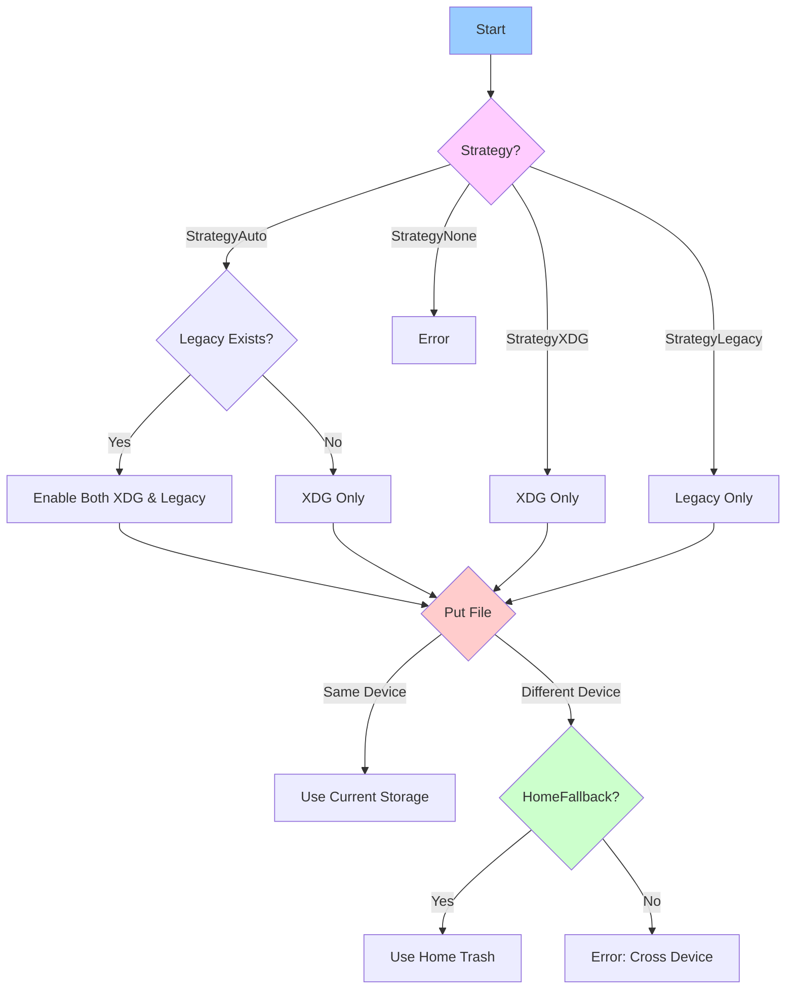
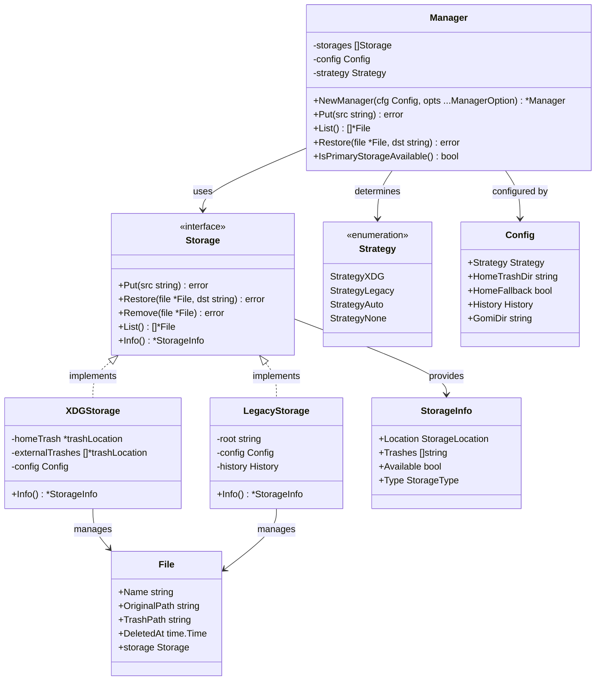

# Gomi Architecture

`gomi` is a CLI trash manager that supports both XDG-compliant trash specification and legacy gomi format. This document explains the key architectural decisions and components of gomi.

## Overview

gomi's architecture is designed around two main concepts:

1. **Strategy**: User-facing configuration that determines how trash management should behave
2. **Storage**: Internal implementation that handles actual file operations

This separation allows for flexible configuration while maintaining clean implementation boundaries.

## Strategy

Strategy determines which trash specification to use. It can be configured in `config.yaml`:

```yaml
core:
  trash:
    strategy: "auto"  # or "xdg" or "legacy"
```



### Available Strategies

- **auto**: Automatically detect and use available storage implementations
  - Uses XDG-compliant storage by default
  - Additionally uses Legacy storage if `~/.gomi` exists
  - Enables smooth transition from legacy to XDG specification

- **xdg**: Strictly follow XDG trash specification
  - Only uses XDG-compliant storage
  - Ignores legacy storage even if it exists
  - Recommended for new installations

- **legacy**: Use gomi's legacy format
  - Only uses legacy storage (`~/.gomi`)
  - Maintains backwards compatibility
  - Recommended only if XDG compliance is not required

## Storage Architecture

<details><summary>diagram</summary>




</details>

### Storage Manager

The Storage Manager acts as a coordinator for multiple storage implementations:

- Manages multiple storage backends
- Routes operations based on selected strategy
- Provides unified interface for trash operations
- Handles storage selection and fallback logic

### Storage Implementations

#### XDG Storage
- Location: `$XDG_DATA_HOME/Trash` or `~/.local/share/Trash`
- Follows XDG trash specification
- Directory structure:
  ```
  Trash/
  ├── files/  # Contains trashed files
  └── info/   # Contains .trashinfo files with metadata
  ```

#### Legacy Storage
- Location: `~/.gomi`
- Original gomi format
- Directory structure:
  ```
  .gomi/
  ├── YYYY/MM/DD/  # Date-based directory structure
  └── history.json # Maintains trash history
  ```

## Design Decisions

### Strategy vs Storage Type Separation

The architecture maintains a deliberate separation between:
- `Strategy`: Represents user's intended trash management approach
- `StorageType`: Represents actual storage implementation

Benefits of this separation:
1. Clear boundaries between configuration and implementation
2. Flexible mapping between user intent and system behavior
3. Better extensibility for future storage types
4. Clean transition paths between different storage types

### Multiple Storage Support

The design supports multiple concurrent storage implementations:
1. Enables gradual migration between storage types
2. Allows unified view of trashed files across storage types
3. Maintains compatibility with existing trash data
4. Facilitates future storage type additions

### Future Extensibility

The architecture is designed to be extensible:
1. New storage types can be added by implementing the Storage interface
2. Strategy patterns can be extended for new use cases
3. Storage Manager can accommodate additional storage types
4. Core operations are storage-implementation agnostic

## Implementation Notes

### Storage Interface

All storage implementations must implement the Storage interface:

```go
type Storage interface {
    Put(src string) error
    Restore(file *File, dst string) error
    Remove(file *File) error
    List() ([]*File, error)
    Info() *StorageInfo
}
```

### File Operations

File operations are handled atomically where possible:
1. Moves within same filesystem use rename
2. Cross-device moves fall back to copy-and-delete
3. Metadata operations are transactional
4. Recovery paths exist for interrupted operations

## Configuration

Default configuration prioritizes XDG compliance while maintaining compatibility:

```yaml
core:
  trash:
    strategy: "auto"  # Default to auto for smooth transition
  home_fallback: true  # Enable fallback for reliable operation
```

## Future Considerations

1. Support for additional trash specifications
2. Enhanced storage backends (e.g., remote storage)
3. Advanced file recovery features
4. Integration with system trash facilities
